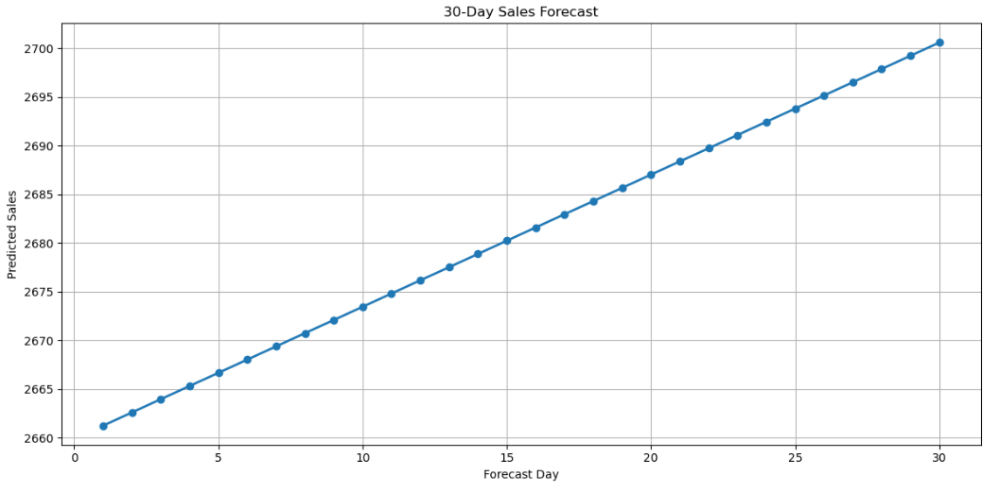

# 📈 FUTURE_ML_01 - Sales & Demand Forecasting Using Machine Learning

## 🎯 Project Objective

The objective of this project is to forecast future sales using historical sales data and Machine Learning techniques. Accurate forecasting helps businesses optimize inventory management, demand planning, and strategic decision-making.

---

## 📂 Dataset Information

| Feature            | Details                   |
| ------------------ | ------------------------- |
| 📊 Dataset Name    | Sample Superstore Dataset |
| 📝 Total Records   | 9,994                     |
| 📋 Total Features  | 21 Columns                |
| 📅 Key Date Column | Order Date                |
| 💰 Target Variable | Sales                     |

---

## 🛠️ Technologies Used

| Technology      | Purpose                      |
| --------------- | ---------------------------- |
| 🐍 Python       | Programming Language         |
| 🐼 Pandas       | Data Manipulation & Analysis |
| 🔢 NumPy        | Numerical Computations       |
| 📈 Matplotlib   | Data Visualization           |
| 🤖 Scikit-Learn | Machine Learning Model       |
| | 📓 Jupyter Notebook | Development Environment | | Development Environment      |

---

## 🔄 Project Workflow

### 📥 1. Data Collection

✔ Loaded the Sample Superstore Dataset

✔ Explored dataset structure and features

---

### 🧹 2. Data Preprocessing

✔ Converted Order Date to datetime format

✔ Checked for missing values

✔ Removed duplicate records

✔ Prepared data for modeling

---

### 📊 3. Exploratory Data Analysis (EDA)

✔ Sales Trend Analysis

✔ Sales Distribution Analysis

✔ Outlier Detection using Box Plot

✔ Monthly Sales Trend Analysis

✔ Rolling Average Trend Visualization

---

### 🤖 4. Model Building

✔ Applied Linear Regression

✔ Split data into Training and Testing sets

✔ Trained the Machine Learning model

---

### 🔮 5. Prediction & Forecasting

✔ Generated sales predictions

✔ Compared Actual vs Predicted Sales

✔ Forecasted sales for the next 30 days

---

## 📈 Model Results

| Metric                         | Status            |
| ------------------------------ | ----------------- |
| ✅ Model Training               | Successful        |
| ✅ Sales Prediction             | Completed         |
| ✅ Actual vs Predicted Analysis | Completed         |
| ✅ Future Forecasting           | 30 Days Generated |
| ✅ Visualization                | Completed         |

---

## 🖼️ Project Visualizations

### 📉 Sales Trend Over Time


---

### 📊 Actual vs Predicted Sales


---

### 🔮 Future Sales Forecast



---

## 💼 Business Impact

This project helps organizations:

✔ Improve inventory planning

✔ Support demand forecasting

✔ Enable data-driven decision making

✔ Reduce stock shortages

✔ Improve operational efficiency

---

## 📁 Repository Structure

```text
FUTURE_ML_01/
│
├── FUTURE_ML_01.ipynb
├── README.md
├── sales trend overtime.png
├── Actual vs predicted sales.png
└── future_sales_forecast.png
```

## 🚀 Future Enhancements

* Implement Random Forest Regression
* Apply XGBoost for better forecasting
* Incorporate seasonal trend analysis
* Deploy as a Streamlit Web Application

---

## 👩‍💻 Author

**Pushpa Raja Kumari Pyla**

🎓 Machine Learning Internship Project

📌 Task 1: Sales & Demand Forecasting Using Machine Learning
